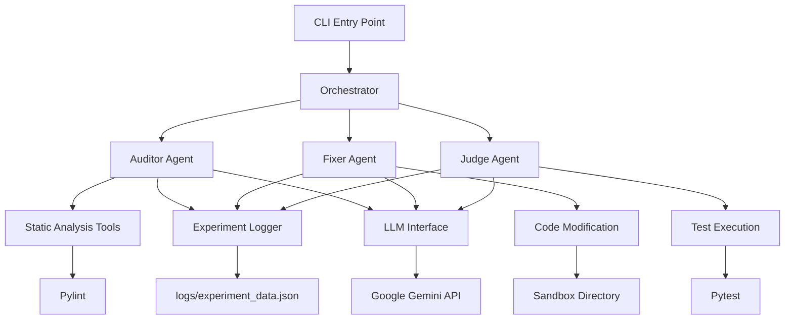
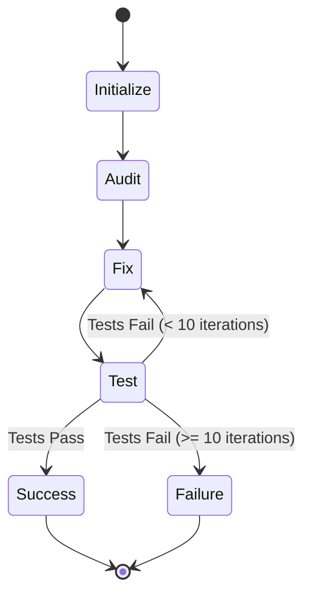

# Design Document

## Overview

The Refactoring Swarm is a multi-agent system built using LangGraph for orchestration and Google Gemini for LLM capabilities. The system processes buggy Python code through a coordinated workflow of specialized agents, each with distinct responsibilities in the refactoring pipeline.

The architecture follows a modular design with clear separation of concerns, leveraging existing utilities for LLM calls and experiment logging while maintaining security through sandboxed operations.

## Architecture

### High-Level Architecture



### Agent Workflow



## Components and Interfaces

### 1. Orchestrator Component

**Location:** `src/orchestrator/workflow.py`

**Responsibilities:**
- Coordinate agent execution sequence
- Manage iteration counting for self-healing loop
- Handle workflow state transitions
- Integrate with LangGraph for agent orchestration

**Key Methods:**
- `create_workflow()`: Initialize LangGraph workflow
- `execute_refactoring(target_dir)`: Main execution entry point
- `handle_iteration_limit()`: Prevent infinite loops

### 2. Auditor Agent

**Location:** `src/agents/auditor.py`

**Responsibilities:**
- Analyze Python code for issues
- Generate comprehensive refactoring plans
- Use Pylint for static analysis
- Provide structured recommendations

**Key Methods:**
- `analyze_code(file_path)`: Perform code analysis
- `generate_refactoring_plan(analysis_results)`: Create action plan
- `run_pylint(file_path)`: Execute static analysis

**Input:** Python source files
**Output:** Structured refactoring plan with prioritized issues

### 3. Fixer Agent

**Location:** `src/agents/fixer.py`

**Responsibilities:**
- Implement code corrections based on refactoring plans
- Maintain code functionality while improving quality
- Operate within sandbox constraints
- Handle incremental fixes

**Key Methods:**
- `apply_fixes(refactoring_plan, file_path)`: Implement corrections
- `validate_syntax(code)`: Ensure syntactic correctness
- `backup_original(file_path)`: Create safety backups

**Input:** Refactoring plan and target files
**Output:** Modified Python files in sandbox

### 4. Judge Agent

**Location:** `src/agents/judge.py`

**Responsibilities:**
- Execute unit tests using pytest
- Validate code functionality
- Provide detailed error feedback
- Determine success/failure status

**Key Methods:**
- `run_tests(test_directory)`: Execute pytest
- `parse_test_results(output)`: Analyze test outcomes
- `generate_feedback(failures)`: Create error reports

**Input:** Modified code in sandbox
**Output:** Test results and feedback

### 5. Security Manager

**Location:** `src/security/sandbox.py`

**Responsibilities:**
- Enforce file operation restrictions
- Validate file paths
- Manage sandbox directory
- Prevent unauthorized access

**Key Methods:**
- `validate_path(path)`: Check path permissions
- `setup_sandbox(target_dir)`: Initialize workspace
- `cleanup_sandbox()`: Remove temporary files

### 6. Tool Integrations

**Location:** `src/tools/`

**Components:**
- `pylint_runner.py`: Pylint integration
- `pytest_runner.py`: Pytest integration
- `file_manager.py`: Safe file operations

## Data Models

### RefactoringPlan

```python
@dataclass
class RefactoringPlan:
    file_path: str
    issues: List[CodeIssue]
    priority: int
    estimated_effort: str
    
@dataclass
class CodeIssue:
    line_number: int
    issue_type: str
    description: str
    suggested_fix: str
    severity: str
```

### TestResult

```python
@dataclass
class TestResult:
    passed: bool
    total_tests: int
    failed_tests: int
    error_details: List[str]
    execution_time: float
```

### AgentState

```python
@dataclass
class AgentState:
    current_files: List[str]
    iteration_count: int
    refactoring_plan: Optional[RefactoringPlan]
    test_results: Optional[TestResult]
    status: str  # "analyzing", "fixing", "testing", "complete", "failed"
```

## Error Handling

### Exception Hierarchy

```python
class RefactoringError(Exception):
    """Base exception for refactoring operations"""
    pass

class SecurityViolationError(RefactoringError):
    """Raised when attempting unauthorized file operations"""
    pass

class AnalysisError(RefactoringError):
    """Raised when code analysis fails"""
    pass

class FixingError(RefactoringError):
    """Raised when code fixing fails"""
    pass

class TestingError(RefactoringError):
    """Raised when test execution fails"""
    pass
```

### Error Recovery Strategies

1. **LLM Call Failures**: Retry with exponential backoff (using existing tenacity configuration)
2. **File Operation Errors**: Validate paths and permissions before operations
3. **Test Failures**: Capture detailed error information for next iteration
4. **Infinite Loop Prevention**: Hard limit of 10 iterations with graceful termination

## Testing Strategy

### Unit Testing Approach

1. **Agent Testing**: Mock LLM responses to test agent logic
2. **Integration Testing**: Test agent interactions with real files
3. **Security Testing**: Verify sandbox restrictions
4. **End-to-End Testing**: Complete workflow validation

### Test Structure

```
tests/
├── unit/
│   ├── test_auditor.py
│   ├── test_fixer.py
│   ├── test_judge.py
│   └── test_orchestrator.py
├── integration/
│   ├── test_agent_workflow.py
│   └── test_security.py
└── fixtures/
    ├── buggy_code/
    └── expected_results/
```

### Testing Guidelines

- Use pytest fixtures for consistent test data
- Mock external dependencies (LLM calls, file system)
- Test both success and failure scenarios
- Validate logging output for all agent interactions
- Ensure security constraints are enforced

## Implementation Considerations

### Performance Optimizations

1. **Parallel Analysis**: Process multiple files concurrently where possible
2. **Incremental Fixes**: Apply fixes in small, testable chunks
3. **Caching**: Cache analysis results for unchanged files
4. **Resource Management**: Limit concurrent LLM calls to avoid rate limits

### Security Measures

1. **Path Validation**: All file operations validated against allowed directories
2. **Sandbox Isolation**: Code modifications restricted to sandbox
3. **Input Sanitization**: Validate all user inputs and file contents
4. **Resource Limits**: Prevent excessive resource consumption

### Monitoring and Observability

1. **Comprehensive Logging**: All agent interactions logged per requirements
2. **Progress Tracking**: Real-time status updates during execution
3. **Performance Metrics**: Track execution time and success rates
4. **Error Reporting**: Detailed error information for debugging

### Integration Points

1. **Existing Utilities**: Leverage `src/utils/llm_call.py` and `src/utils/logger.py`
2. **Configuration**: Use environment variables for API keys and settings
3. **CLI Interface**: Maintain compatibility with existing `main.py` structure
4. **Dependencies**: Build on existing requirements.txt foundation